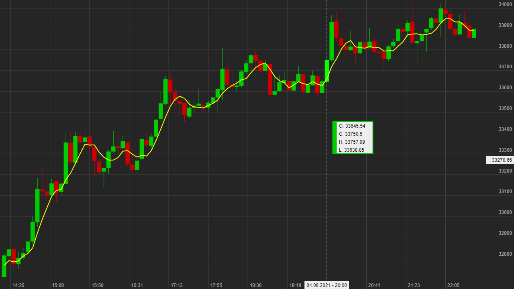
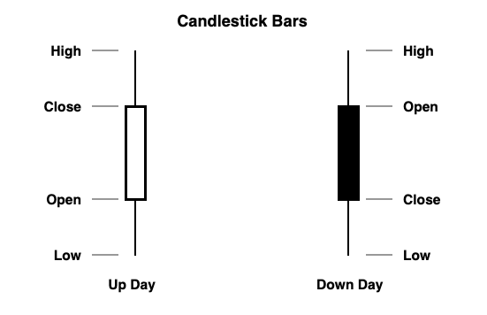
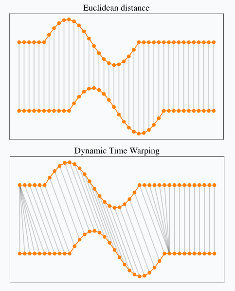
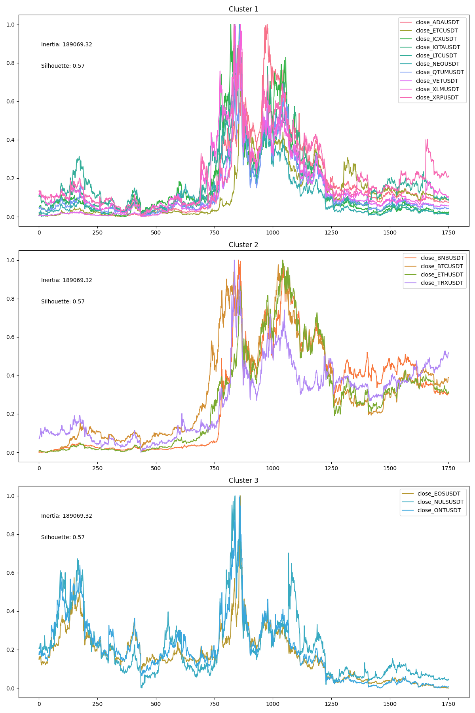
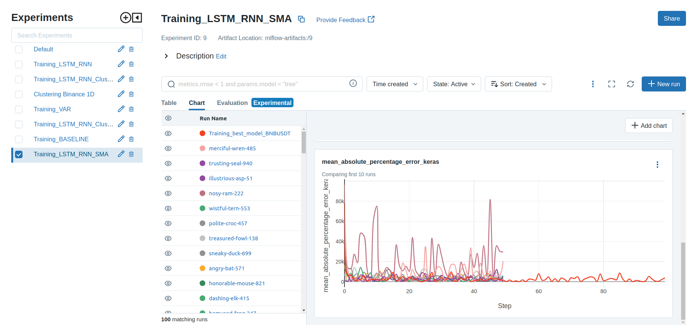
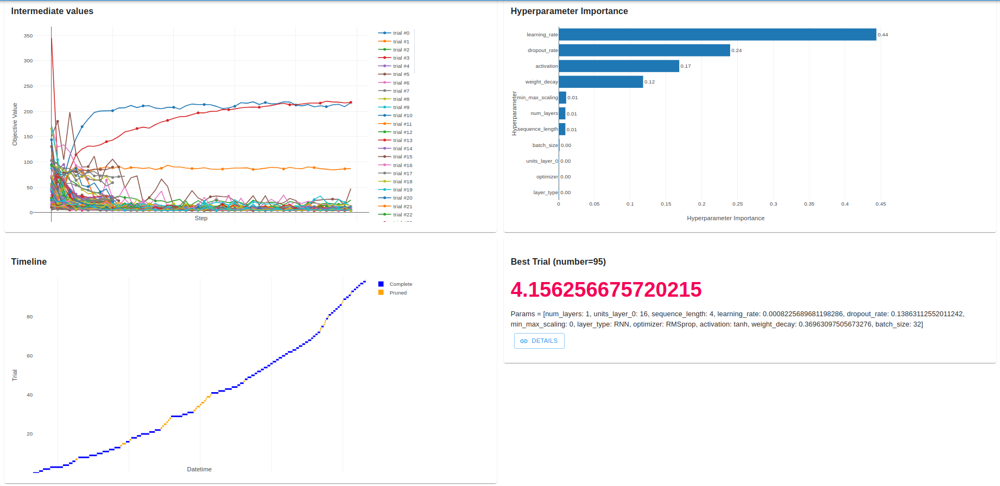
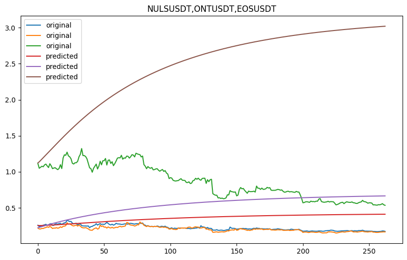
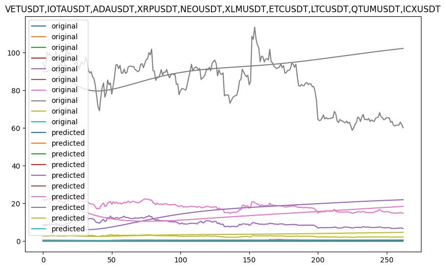

# Price Oracle


- [Price Oracle](#price-oracle)
  - [Data, Modeling and Experiments](#data-modeling-and-experiments)
    - [Data](#data)
      - [Data Sources](#data-sources)
        - [Historical Data](#historical-data)
        - [Live Data](#live-data)
        - [SMA](#sma)
    - [Clustering](#clustering)
      - [Dynamic Time Warping (DTW)](#dynamic-time-warping-dtw)
      - [Cluster Metrics and Heuristics](#cluster-metrics-and-heuristics)
      - [Results](#results)
    - [Modeling](#modeling)
      - [Mlflow \& Optuna](#mlflow--optuna)
      - [Baseline](#baseline)
        - [Results](#results-1)
      - [VAR](#var)
        - [Optimization](#optimization)
        - [Results](#results-2)
      - [Neural Networks](#neural-networks)
        - [Optimization](#optimization-1)
        - [Results](#results-3)
  - [Architecture components](#architecture-components)
    - [Docker](#docker)
    - [Kubernetes](#kubernetes)
    - [Helm](#helm)
    - [Skaffold](#skaffold)
    - [Kind](#kind)
    - [Apache Airflow](#apache-airflow)
    - [Apache Cassandra](#apache-cassandra)
    - [Apache Spark](#apache-spark)
    - [Mlflow](#mlflow)
    - [Grafana](#grafana)
  - [Application Flow](#application-flow)
    - [DAGs](#dags)
      - [1. Ingestion DAG (initial\_data\_loading)](#1-ingestion-dag-initial_data_loading)
      - [2. Fetch daily data (fetch\_daily\_ohlc)](#2-fetch-daily-data-fetch_daily_ohlc)
      - [3. Compute indicators (compute\_indicators)](#3-compute-indicators-compute_indicators)
      - [4. Baseline model (baseline\_model\_predict)](#4-baseline-model-baseline_model_predict)
      - [5. Custom model training and prediction (lstm\_rnn\_training)](#5-custom-model-training-and-prediction-lstm_rnn_training)
  - [Visualization](#visualization)
  - [Issues and Future Directions](#issues-and-future-directions)
    - [Data concerns](#data-concerns)
    - [Models re-train and Concept Drift](#models-re-train-and-concept-drift)
    - [Pipelines for all models](#pipelines-for-all-models)


<br>

Price Oracle is an end-to-end solution for monitoring and predicting the price of criptocurrencies.  
It is composed of data ingestion pipelines leveraging Apache Airflow, an Apache Cassandra database, machine learning models built with TensorFlow and a front-end built with Grafana.  
The automated data ingestion pipelines provide real-time data, which are used to train the machine learning models and to provide real-time predictions.

## Data, Modeling and Experiments

### Data

The data used in this project are **OHLCV** data for 17 different cryptocurrencies pair with the USDT stable coin.

An OHLCV chart, short for open-high-low-close chart, is a type of chart used predominantly in financial trading. These charts are utilized to illustrate movements in the price of a financial instrument over time.

<figure>
  <p align="center">
    
    <br>
    <i>OHCLV chart BTC</i>
  </p>
</figure>

Each vertical line on the chart shows the price range (the highest and lowest prices) over one unit of time, such as an hour, a day, or a week.

In this chart, four critical points of data are displayed for each time unit: 

|||
| ------------- | --- |
| **Open Price**   | The open price is the price at which a financial instrument starts trading when the exchange opens for a specific period—like the beginning of the day for daily charts.                                                    |
| **High Price**    | The high price is the maximum price at which the financial instrument traded during the given period. This data point is essential as it gives traders an idea about the strength of the buying activity during that period |
| **Low Price**     | In contrast, the low price is the minimum price at which the financial instrument traded during the same period. This information reveals the selling pressure during the given time frame.                                 |
| **Closing Price** | The closing price is the final price at which the financial instrument trades during the period before the market closes. |
| **Volume** | The volume is the total amount of a security that was traded during a given period of time.  |
|||

<br>

<figure>
  <p align="center">
    
    <br>
    <i>OHCL candlestick</i>
  </p>
</figure>

The *Closing Price* is often considered the most significant price because it determines the net change for the period and sets the price level for the start of the next period. Net change refers to the difference between the beginning and ending balances of a financial metric over a specified period. For this reason it is the main piece of information used in this project.

In this project the data is represented within the daily timeframe. This means that each candlestick represents the price of the cryptocurrency for one day.

The 17 criptos analyzed are the following:  

|  |   | |
| -------------------- | ---------------------  | -------------------  |
| Cardano (ADA)        | Binance Coin (BNB)     | Bitcoin (BTC)        |
| EOS                  | Ethereum Classic (ETC) | Ethereum (ETH)       |
| Icon (ICX)           | IOTA                   | Litecoin (LTC)       |
| XRP                  | NEO                    | NULS                 |
| Ontology (ONT)       | Qtum                   | Tron (TRX)           |
| VeChain (VET)        | Stellar (XLM)          |                      |
||||

<br>

#### Data Sources

The data used in this project are collected from two different sources: 
- [CriptoDataDownload](https://www.cryptodatadownload.com/data/binance/)
- [KRAKEN api](https://docs.kraken.com/rest/)


##### Historical Data

The website CriptoDataDownload offers historical OHLCV data from a large number of exchanges.
The Binance exchange data was selected because it is one of the most popular and reliable exchange platforms for criptocurrencies and it offers a huge amount of cripto pairs.

For the purpose of this project 286 cripto pairs have been downloaded in csv format from CriptoDataDownload. Among the initial 286 cripto pairs, the 17 pairs having data starting from 2019-01-01 were selected.


##### Live Data

Being the data statically provided with csv files, these are used for the initial loading of historical data.

In order to retrived live data, the Kraken API's are queried by the system on a daily basis.  
The fresh data are used as enrichment to the past data to evaluate the models performances and retrain them when necessary.


##### SMA

In order to try to improve the models performances, some indicators were computed on the data.
These indicators are the **Simple Moving Average** (SMA) with different window sizes.  
SMA is a technical analysis indicator that smooths out price data by creating a constantly updated average price. This provides the model with insights on the trend of the price further than the single day price or the chosen sequence lenght fed to the model.

SMA are computed with the following window sizes: 5, 10, 20, 50, 100, 200.  
In this case, the window size represent days.


### Clustering

In the scope of this project two types of model were considered:

- Single-Target
- Multi-Target

Single-Target models are models that predict a single target value. In this case, these models take as input the time series data of a single criptocurrency and try to predict future values for that criptocurrency.

On the other hand, Multi-Target models are models that predict a set of target values. In this case, these models take as input the time series data of multiple criptocurrencies and try to predict future values for all of them.

In order to have the models with their goal, the 17 criptocurrencies have been clustered using some common algorithms.

#### Dynamic Time Warping (DTW)

For the purpose of clustering the criptocurrencies, the DWT algorithm was used to extract distances between the time series. The algorithm was applied to the closing price of the criptocurrencies. This step is crucial for the clustering phase because DWT distances are then used as input for the clustering algorithm.

In time series analysis, dynamic time warping (DTW) is an algorithm for measuring similarity between two temporal sequences, which may vary in speed.

In general, DTW is a method that calculates an optimal match between two given sequences (e.g. time series) with certain restriction and rules:
- Every index from the first sequence must be matched with one or more indices from the other sequence, and vice versa
- The first index from the first sequence must be matched with the first index from the other sequence (but it does not have to be its only match)
- The last index from the first sequence must be matched with the last index from the other sequence (but it does not have to be its only match)
- In the process of matching indices between two sequences, it is imperative to maintain the condition that when one index in the first sequence is smaller than another, the corresponding indices in the second sequence must follow the same order, and this requirement holds true in both directions, ensuring a monotonically increasing relationship between the indices.

In contrast, the Euclidean distance, a more traditional distance metric, does not account for variations in time or phase shifts and directly compares the values of corresponding data points. It assumes that both sequences are aligned and have the same length. Therefore, DTW is a more flexible and robust approach for comparing time series with variable time or speed, making it suitable for cryptocurrency time series clustering.

<br>
<figure>
  <p align="center">
    
    <br>
    <i>Comparison between DTW and Euclidean distance</i>
  </p>
</figure>

#### Cluster Metrics and Heuristics

For the evaluation of the clustering results, some heuristics were taken into account:

- only clustering resulting in 3 or more clusters were considered for consistency;
- results of experiments were the data was normalized with min-max scaling were preferred because were more convincing

In additional to the heuristics above, the results of the clustering were evaluated on the **Silhouette score** and the **Inertia score**.

The *Silhouette score* is a metric that measures how similar an object is to its own cluster (*cohesion*) compared to other clusters (separation). The Shilouette score ranges from -1 to 1, where a higher value indicates that the object is better matched to its own cluster and worse matched to neighboring clusters. If many points have a high shilouette value, the clustering configuration is good. If many points have a low or negative shilouette value, the clustering configuration may have too many or too few clusters.

On the other hand the *Intertia score* is a metric that measures how spread out the clusters are (lower is better). The inertia score is calculated as the sum of squared distance for each point to it's closest centroid, and the lower the inertia score, the more uniform the clusters are (clusters are tight).


#### Results

For the clustering experiments, the following algorithms were tested:

- K-Means
- K-Medoids

After some experiments, the K-Means algorithm was selected as the best algorithm and the chosen experiments was the one with the number of clusters equal to 3 and the cluster separtion looks like the following:

<br>
<figure>
  <p align="center">
    
    <br>
    <i>Comparison between DTW and Euclidean distance</i>
  </p>
</figure>
<br>

The following table shows the cluster of each criptocurrency:

| Cluster | Symbols                                     |
|---------|---------------------------------------------|
| 0       | ADAUSDT, ETCUSDT, ICXUSDT, IOTAUSDT, ...    |
| 1       | BNBUSDT, BTCUSDT, ETHUSDT, TRXUSDT          |
| 2       | EOSUSDT, NULSUSDT, ONTUSDT                  |

<br>

### Modeling

One of the main goal of this projects was to reliable predict the *closing price* of the criptocurrencies for the following day.
In order to achieve this goal, different models and configurations were tested.
Also, **MLflow** was employed for experiment tracking and **Optuna** for hyperparameters optimization.

#### Mlflow & Optuna

MLFLow is a software that allows to track Machine Learning experiments and models. It stores the metrics of the experiments, allowing the developer to compare different models and parameters. Also, allows to store the models and retrieve them when needed. In this project MLflow tracks every experiment, params and metrics which are available for consultation in a convenient GUI.

<br>

<figure>
  <p align="center">
    
    <br>
    <i>MLflow GUI. On the right, all of the runs are listed. Each run is associated with its parameters and metrics. Runs are grouped by experiments, which are listed on the left. MLflow allows to compare the metrics of different runs.</i>
  </p>
</figure>

<br>

Optuna is an open source hyperparameter optimization framework to automate hyperparameter search. The main features of Optuna that were used in this project are:
- *Systematic exploration of hyper-parameters space*: using a TPE sampler, which is an indipendent sampler, the exploration of the hyper-parameters space was conducted in order to minimize the value of the mean squared error metric;
- *Early Pruing*: by using a Median Pruner, unpromising trials are stopped after few iterations, in order to spend more time exploring proming configurations. The median pruner prunes a trial if its results are worse than the median of the previous trials results.

By using Optuna, 100 configurations of hyper-paramters were tested for each model.  

Optuna experiments are grouped by *study*, and each of them is tracked by MLflow.  

Optuna also provides a convenient GUI, called *Optuna Dashboard*, which allows to visualize the results of the hyper-parameters optimization.

<br>
<figure>
  <p align="center">
    
    <br>
    <i>The study view in Optuna Dashboard. Top-left shows all of the runs, with the evolution of the metrics for each epoch. Bottom-left shows the timeline of runs. The color scheme indicates if a run has been completed or pruned. Top-right reports the importance of each hyper-parameter. Bottom-right shows the best run and the associated hyper-parameters.</i>
  </p>
</figure>


#### Baseline

When predicting time series and in particular financial data, it is easy to achieve result that seem to good to be true. This is because prices are strongly related to their previous values and next values don't deviate too much.

For this reason, a very simple algorithmic model was evaluated, to be used as **baseline**, against which machine learning models performance are measured.

The algorithm simply predicts, for the next day, the closing price of the previous day.

##### Results

As expected, the MAPE for this approach is low, ranging from 2.38% to 4.37% for the different cryptocurrencies.

The complete results of the baseline model evaluation can be found [here](./docs/Price_Oracle_Experiments.xlsx).

#### VAR

Vector Autoregression (VAR) models are a class of time series models commonly used in econometrics and statistics to analyze and forecast multivariate time series data.  
VAR models are a natural extension of univariate autoregressive models (AR), allowing for the simultaneous modeling of multiple related time series variables.

In VAR models, each variable is regressed on its own past values and the past values of all the other variables in the system. This captures the interdependencies between the variables over time.

##### Optimization

For the VAR modeling, the following hyper-parameters were optimized:

| **Hyper-parameter** | **Legal values** |
| -------------------- | ---------------------  |
| Trend | n, c, t, ct |
| Sequence Length | 1 to 5 |
| Min Max Scaling | True, False |

##### Results

Detailed results of VAR models evaluation can be found [here](./docs/Price_Oracle_Experiments.xlsx).

In general, the VAR model **underfits** data, being unable to model the non-linearities, and the predictions are not accurate.  
MAPE metrics range from 60% to 160%.

<br>

<figure>
  <p align="center">
    
    <br>
    <i>VAR model predictions for a cluster of coins. The model underfits the data</i>
  </p>
</figure>

<br>

<figure>
  <p align="center">
    
    <br>
    <i>VAR model predictions for a cluster of coins. The model underfits the data</i>
  </p>
</figure>

#### Neural Networks

Neural Networks are a class of machine learning models that are inspired by the structure of the brain.  
They are composed of layers of neurons, which are connected to each other.
Many architectures of neural networks have been developed.

When dealing with time series, LSTM and RNN are the most common architectures used.

RNN (Recurrent Neural Network) are a class of neural networks that are able to process sequences of inputs.
The main feature of RNN is that they have a *memory*, which allows them to process sequences of inputs.   
The memory is achieved by using the output of a neuron at time *t* as an input for the same neuron at time *t+1*.

LSTM (Long Short-Term Memory) networks are a type of recurrent neural network capable of learning order dependence in sequence prediction problems.
LSTM networks have memory blocks that are connected through layers.  
A block contains gates that manage the block’s state and output.  
A block operates upon an input sequence and each gate within a block uses the sigmoid activation units to control whether they are triggered or not, making the change of state and addition of information flowing through the block conditional.

All of these features make these types of networks particularly suitable for time series prediction.

##### Optimization

Neural Networks are very complex models, and they have a lot of hyper-parameters that can be optimized.  
Also, in this project, the choice of using LSTM or RNN was also considered a hyper-parameter and optimized with Optuna.

A diffrent optimization was performed for each of the following configurations:
- criptocurrency or cluster of criptocurrencies (17 criptocurrencies, 3 clusters)
- price time-series only or price time-series and SMA indicators

This means that 20 * 2 = 40 optimizations were performed.

The following hyper-parameters were optimized:

| **Hyper-parameter** | **Legal values** |
| -------------------- | ---------------------  |
| Number of layers | 1 to 4 |
| Units per layer | 8 to 32, step 8 |
| Sequence Length | 1 to 5 |
| Learning Rate | 1e-6 to 1e-3 |
| Dropout Rate | 0.0 to 0.5 |
| Min Max Scaling | True, False |
| Layer Type | LSTM, RNN |
| Optimizer | Adam, RMSprop |
| Activation | relu, tanh, sigmoid |
| Weight Decay | 0.0 to 0.5 |
| Batch Size | 8 to 32, step 8 |

##### Results

Detailed results of Neural Networks models evaluation can be found [here](./docs/Price_Oracle_Experiments.xlsx).

In general, the Neural Networks models have good performances, with MAPE metrics ranging from 1.58% to 5.68%.
In many cases the models are able to overperform the baseline model.

However, some criptocurrencies present a very high MAPE, in one case even over 20%.

The metrics for single-target models are generally better than the metrics for multi-target models, except for the cases described above.  
In fact, it is possible that the multi-target models metrics are affected by the outliers with high MAPE. 

After investigating and resolving the issues with the outliers, it could be possible that the multi-target models will have better metrics than the single-target models.


## Architecture components

Price Oracle is developed in a fully containerized environment, composed of various components.  
The application flow is entirely run on a Kubernetes cluster, which is deployed locally using Kind.  
In these section the components will be briefly described.

<br>

<!-- Center text and image -->
<p align="center">
  
  <br>
  <i>Architecture of the Price Oracle project</i>
</p>
  

### Docker

Docker is a technology that allows to package an application along with all of its dependencies into a standardized unit for software development.  
This allows for complete reproducibility of the application, regardless of the environment in which it is run.  

### Kubernetes

Kubernetes is an open-source container-orchestration system for automating computer application deployment, scaling, and management.  
Paired with Docker, it allows to deploy and manage containers in a cluster of machines.  
It allows for abracting away the infrastructure and managing things like networking, storage, load balancing, etc.

### Helm

Helm is a package manager for Kubernetes.
Helm charts are used to define, install, and upgrade Kubernetes applications.
Many Helm charts are available for common applications, such as Apache Airflow, Apache Cassandra, Apache Spark, Grafana, etc.

### Skaffold

Skaffold is a command line tool that facilitates continuous development for Kubernetes applications.  
It handles the workflow for building, pushing and deploying applications.

In the Price Oracle project, Skaffold uses the Helm charts to deploy the applications on the Kubernetes cluster.

### Kind

Kind is a tool for running local Kubernetes clusters using Docker container “nodes”.  
It allows to run a Kubernetes cluster on a single machine, which is useful for development and testing.  

For this project, it is used to run a local Kubernetes cluster on the developer's machine.  

### Apache Airflow

Apache Airflow is an open-source workflow management platform.  
It allows to define, schedule and monitor workflows, which are defined as DAGs (Directed Acyclic Graphs).  
DAGs can be used to define data ingestion pipelines, which are used to ingest data from different sources and store them in a data lake.  
DAGs can also be used to train machine learning models and to provide real-time predictions.  

### Apache Cassandra

Apache Cassandra is a free and open-source, distributed, wide column store, NoSQL database management system.   

In the Price Oracle project, it is used as a data lake to store the data ingested by the data ingestion pipelines.  
It also stores the machine learning models predictions and metrics.

### Apache Spark

Apache Spark is an open-source unified analytics engine for large-scale data processing.  

In the Price Oracle project, it is used to compute some indicators on the data stored in the database.  

### Mlflow

Mlflow is an open-source platform to manage the ML lifecycle, including experimentation, reproducibility and deployment.

In the Price Oracle project, it is used to track the machine learning models experiments and to store the models artifacts.

### Grafana

Grafana is an open-source analytics and monitoring solution.  
In the Price Oracle project, it is used to visualize the data stored in the data lake and the machine learning models predictions.  

## Application Flow

The hearth of the Price Oracle project are the **Airflow DAGs**, which defined the entire application flow.  
When the cluster is first spin up, a CSV file containing the historical data for each one of the 17 cryptocurrencies is packed into the Airflow image.    
The CSVs contain OHLCV data for each cryptocurrency, with the prices referring to the pair with the USDT stable coin. *(Refer to the [Data](#data) section for more details)*  
For each of the cryptocurrencies, a set of 5 dags is dynamically defined, for a total of 85 DAGs.

This DAGs, explained in detailed in the [DAGs](#dags) section, are used to:
- Ingest the initial data from the CSV file into the database
- Periodically ingest real-time data from the Kraken API into the database
- Periodically compute SMA indicators on the data stored in the database
- Perform predictions with a baseline model, storing the results and performance metrics in the database
- Perform predictions with a tuned model, configured based on the results of the results of the Optuna hyperparameter tuning, storing the results and performance metrics in the database


Each of the DAGs writes the results of the computations into the database.  
This allow to visualize in real time the data in the *Price Oracle Dashboard* automatically created in Grafana via a *Kubernetes ConfigMap*.


***Note**: The dags are disabled by default to avoid to overload the host machine. To run them it is necessary to enable them from the Airflow UI.*

### DAGs

The DAGs are defined in the `airflow/dags` folder.  
For each cryptocurrency, a set of 5 DAGs is defined:

<figure>
  <p align="center">
    
    <i>DAGs for the BITCOIN criptocurrency</i>
  </p>
</figure>

#### 1. Ingestion DAG (initial_data_loading)

The ingestion DAG is used to ingest the initial data from the CSV file into the database.  
This DAG as a *@once* shcedule, which means that it is executed only once.  


It is composed of only 2 tasks:
- `fetch_data`: 
  - reads the CSV file containing the historical data for the cryptocurrency and converts it into a common format
- `insert_into_cassandra_price_candlestick`: 
  - inserts the data into the *price_canldestick* table of the Cassandra database

<br>


<p align="center">
  
  <br>
  <i>initial_data_loading DAG composition</i>
</p>

#### 2. Fetch daily data (fetch_daily_ohlc)

The fetch daily data DAG is used to periodically ingest real-time data from the Kraken API into the database.  
Since the platform uses daily data, the DAG is scheduled to run once a day.  
This DAG is configured with the *catchup* parameter set to *True*, which means that it will run all the missed DAG runs.  
So it will run once for each day since the last data point present in the CSV files to the current day.
The Krakend API has a limit of requests per minute, so some errors are expected when backfilling multiple days. The task is automatically rescheduled in case of error.

It is composed of 2 tasks:
- `fetch_data`: 
  - fetch the data from the Kraken API and converts it into a common format
- `insert_into_cassandra_price_candlestick`: 
  - inserts the data into the *price_canldestick* table of the Cassandra database

<p align="center">

<br>
<i>initial_data_loading DAG composition. Each of the green columns is a DAG run, automatically scheduled via the cathup option.</i>
</p>
  
#### 3. Compute indicators (compute_indicators)

The compute indicators DAG is used to periodically compute SMA indicators on the data stored in the database.  
It computes SMA indicators with a window of 5, 10, 20, 50, 100, 200 data points.  
Since new data is ingested every day, the DAG is scheduled to run once a day to compute the indicators on the new data.
The computation is performed using Apache Spark:
  
```python
  # Calculate Simple Moving Average (SMA) for each window size
  for window_size in sma_window_sizes:
      # Define the column name for the SMA
      sma_column = f"sma_{window_size}"
      # Calculate the SMA using a window function
      df = df.withColumn(
        sma_column, 
        F.avg("close_price").over(window_spec.rowsBetween(-window_size, 0))
      )
```

It is composed of 4 tasks:
- `wait_for_initial_data_loading`: 
  - this is a special task called *sensor* in Airflow. It waits for the DAG *initial_data_loading* to complete before starting the DAG, to be sure that the data used by the computations is present in the database.  
  If the DAG *initial_data_loading* has not been executed yet, this task will wait for it to be executed and check again at a fixed interval.
- `fetch_data`: 
  - fetch the data from the Cassandra database and converts it into a common format.  
  The data is read by using the Spark SQL connector.
- `compute_indicators`: 
  - computes the SMA indicators using Apache Spark
- `insert_into_cassandra_indicators`: 
  - inserts the data into the *indicators* table of the Cassandra database

<br>

<p align="center">

  <br>
  <i>compute_indicators DAG composition. The first task is an ExternalTaskSensor that waits for the initial_data_loading DAG to complete.</i>
</p>

#### 4. Baseline model (baseline_model_predict)

The baseline model DAG is used to perform predictions with a baseline model, storing the results and performance metrics in the database.
The baseline model is a simple model that predicts the price of the next day as the price of the current day (Lag 1).
Thus it does not use any machine learning algorithm and doesn't require any training.
Since new data is ingested every day, the DAG is scheduled to run once a day to compute the predictions and metrics on the new data.

It is composed of 6 tasks:
- `wait_for_initial_data_loading`: 
  - this is a special task called *sensor* in Airflow. It waits for the DAG *initial_data_loading* to complete before starting the DAG, to be sure that the data used by the computations is present in the database.  
  If the DAG *initial_data_loading* has not been executed yet, this task will wait for it to be executed and check again at a fixed interval.
- `fetch_data`: 
  - fetch the data from the Cassandra database and converts it into a common format.  
  The data is read by using the Spark SQL connector.
- `predict`: 
  - performs the predictions with the baseline model
- `insert_into_cassandra_predictions`: 
  - inserts the predictions into the *predictions* table of the Cassandra database
- `compute_metrics`: 
  - computes the performance metrics of the model
- `insert_into_cassandra_metrics`:
  - inserts the performance metrics into the *metrics* table of the Cassandra database

<br>

<p align="center">

<br><i>baseline_model_predict DAG composition. The insert_into_cassandra_predictions and compute_metrics branches start in parallel after the *predict* task.</i>
  </p>
  
#### 5. Custom model training and prediction (lstm_rnn_training)

The custom model training and prediction DAG is used to train a custom model, perform predictions and store the results and performance metrics in the database.
The model is an Neural Network (LSTM or RNN), built based on the results of the Optuna hyperparameter tuning.
Since new data is ingested every day, the DAG is scheduled to run once a day to retrain the model, compute the predictions and metrics on the new data.

It is composed of 7 tasks:

- `wait_for_initial_data_loading`: 
  - this is a special task called *sensor* in Airflow. It waits for the DAG *initial_data_loading* to complete before starting the DAG, to be sure that the data used by the computations is present in the database.  
  If the DAG *initial_data_loading* has not been executed yet, this task will wait for it to be executed and check again at a fixed interval.

- `fetch_data`:
  - fetch the data from the Cassandra database and converts it into a common format.  
  The data is read by using the Spark SQL connector.

- `train`:
  - This task retrieves the best hyperparameters from the MLFlow instance running on the cluster and builds a model with those hyperparameters.
  The model is then trained on the data and stored in the MLFlow instance.

- `predict`:
  - This task loads the model from the MLFlow instance and performs the predictions.
  
- `insert_into_cassandra_predictions`:
  - inserts the predictions into the *predictions* table of the Cassandra database

- `compute_metrics`:
  - computes the performance metrics of the model
  
- `insert_into_cassandra_metrics`:
  - inserts the performance metrics into the *metrics* table of the Cassandra database

<br>

<p align="center">

<br>
<i>lstm_rnn_training DAG composition. The insert_into_cassandra_predictions and compute_metrics branches start in parallel after the predict task.</i>
</p>


## Visualization

Another core component of the Price Oracle project is the *Price Oracle Dashboard*, which is automatically created in Grafana via a *Kubernetes ConfigMap*.

The dashboard is dynamically created and leverages the *variables* feature of Grafana.
The list of the cryptocurrencies is stored into a *Grafana variable*, and this allow the user to select the cryptocurrency to visualize in the dashboard.

***Note**: the list of the cryptocurrencies in the variable is NOT dynamically updated at the moment.*

The default view presents the BTC/USDT pair.  
A select component in the top allows to select the cryptocurrency to visualize. Multiple cryptocurrencies can be selected at the same time.

<figure>
  <p align="center">
  
  <br>
  <i>Price Oracle Dashboard - Default view</i>
  </p>
</figure>

For each cryptocurrency, the dashboard shows 3 panels.  
The second and third panels are tables that show the MAPE and RMSE metrics of the baseline model and the custom model respectively.  
This metrics are computed by taking into account the last 7, 30, 60 days of data, and also the entire dataset.


<figure>
  <p align="center">
  
  <i>MAPE panel for BTCUSDT</i>
</p>
</figure>

<br>

<figure>
  <p align="center">
  
  <i>RMSE panel for BTCUSDT</i>
</p>
</figure>

<br>

The first panel is a graph that shows the price of the cryptocurrency as a line graph.
On top of the actual price, most of the data computed by the pipelines ends up here.  
The SMA indicators are shown as line graphs, with different colors for each window size.   
Also, the predictions of the baseline model and the custom model are justaposed. This allows to visually compare the predictions of the two models.

***Note**: each line can be toggled on and off by clicking on the legend.*

<figure>
  <p align="center">
  
  <i>Price panel for BTCUSDT</i>
  </p>
</figure>

<figure>
  <p align="center">
  
  <i>Price panel for BTCUSDT. Only the actual price and the prediction lines are enabled. The time range is restricted to show the differences between the 3 lines.</i>
  </p>
</figure>

<br>

## Issues and Future Directions

### Data concerns

During the development of the project, some problems emerged regarding the collection of data.  
During the last years, a lot of services offering data have been shut down, and the ones that are still available offer only a limited amount of data for free.  
For example, just during the development of the project, the Criptowatch API, that was selected as the main source of data, has been shut down (and replaced by the Kraken API).  
However, the Kraken API doesn't offer all of the coin pairs that were used in this project, so the *daily_data_fetch* DAG works only for some of the cryptocurrencies.

In general, it is becoming harder and harder to find a reliable source of data that offers a large amount of data for free, especially for some sectors like the cryptocurrency one.


### Models re-train and Concept Drift

For time related issues, the models are retrained entirely every day.  
However, the initial plan was to retrain the models only when the performance metrics were below a certain threshold, indicating a concept drift.
This would be easily implemented with the current architecture, editing the training DAG in this way:
- add an initial task that reads the performance metrics from the database
- add another task that predicts the all of the data (including the new data) and computes the performance metrics
- add a *sensor* that checks if the performance metrics are below the threshold (e.g: the new MAPE at 7 days is worse than the previous one by a certain number of standard deviations)
- if the *sensor* is triggered, the DAG continues with the training and prediction tasks; otherwise, there is no need to retrain the model.

### Pipelines for all models

For time related issues, only the pipelines for the LSTM and RNN models have been implemented, and only for the version considering the price time-series only.

However, experiments have been performed also with:
- a version considering the price time-series and the SMA indicators
- a version considering the criptocurrency in clusters
- a version using a VAR model.

Adding the pipelines for these models would be straightforward, since the architecture is already in place.
