# Price Oracle


- [Price Oracle](#price-oracle)
  - [Data, Experiments and Modeling](#data-experiments-and-modeling)
    - [Data](#data)
    - [Clustering](#clustering)
    - [Modeling](#modeling)
      - [Mlflow \& Optuna](#mlflow--optuna)
    - [Results](#results)
  - [Architecture - Components](#architecture---components)
    - [Docker](#docker)
    - [Kubernetes](#kubernetes)
    - [Helm](#helm)
    - [Skaffold](#skaffold)
    - [Kind](#kind)
    - [Apache Airflow](#apache-airflow)
    - [Apache Cassandra](#apache-cassandra)
    - [Apache Spark](#apache-spark)
    - [Mlflow](#mlflow)
    - [Grafana](#grafana)
  - [Application Flow](#application-flow)
    - [DAGs](#dags)
      - [1. Ingestion DAG (initial\_data\_loading)](#1-ingestion-dag-initial_data_loading)
      - [2. Fetch daily data (fetch\_daily\_ohlc)](#2-fetch-daily-data-fetch_daily_ohlc)
      - [3. Compute indicators (compute\_indicators)](#3-compute-indicators-compute_indicators)
      - [4. Baseline model (baseline\_model\_predict)](#4-baseline-model-baseline_model_predict)
      - [5. Custom model training and prediction (lstm\_rnn\_training)](#5-custom-model-training-and-prediction-lstm_rnn_training)
  - [Visualization](#visualization)
  - [Issues and Future Directions](#issues-and-future-directions)
    - [Data concerns](#data-concerns)
    - [Models re-train and Concept Drift](#models-re-train-and-concept-drift)
    - [Pipelines for all models](#pipelines-for-all-models)

<br>

Price Oracle is an end-to-end solution for monitoring and predicting the price of criptocurrencies.  
It is composed of data ingestion pipelines leveraging Apache Airflow, an Apache Cassandra database, machine learning models built with TensorFlow and a front-end built with Grafana.  
The automated data ingestion pipelines provide real-time data, which are used to train the machine learning models and to provide real-time predictions.

## Data, Experiments and Modeling
### Data
### Clustering
### Modeling
#### Mlflow & Optuna
### Results

## Architecture - Components

Price Oracle is developed in a fully containerized environment, composed of various components.  
The application flow is entirely run on a Kubernetes cluster, which is deployed locally using Kind.  
In these section the components will be briefly described.

<br>

<figure>
  <p align="center">
  
  <i>Architecture of the Price Oracle project</i>
  </p>
</figure>


### Docker

Docker is a technology that allows to package an application along with all of its dependencies into a standardized unit for software development.  
This allows for complete reproducibility of the application, regardless of the environment in which it is run.  

### Kubernetes

Kubernetes is an open-source container-orchestration system for automating computer application deployment, scaling, and management.  
Paired with Docker, it allows to deploy and manage containers in a cluster of machines.  
It allows for abracting away the infrastructure and managing things like networking, storage, load balancing, etc.

### Helm

Helm is a package manager for Kubernetes.
Helm charts are used to define, install, and upgrade Kubernetes applications.
Many Helm charts are available for common applications, such as Apache Airflow, Apache Cassandra, Apache Spark, Grafana, etc.

### Skaffold

Skaffold is a command line tool that facilitates continuous development for Kubernetes applications.  
It handles the workflow for building, pushing and deploying applications.

In the Price Oracle project, Skaffold uses the Helm charts to deploy the applications on the Kubernetes cluster.

### Kind

Kind is a tool for running local Kubernetes clusters using Docker container “nodes”.  
It allows to run a Kubernetes cluster on a single machine, which is useful for development and testing.  

For this project, it is used to run a local Kubernetes cluster on the developer's machine.  

### Apache Airflow

Apache Airflow is an open-source workflow management platform.  
It allows to define, schedule and monitor workflows, which are defined as DAGs (Directed Acyclic Graphs).  
DAGs can be used to define data ingestion pipelines, which are used to ingest data from different sources and store them in a data lake.  
DAGs can also be used to train machine learning models and to provide real-time predictions.  

### Apache Cassandra

Apache Cassandra is a free and open-source, distributed, wide column store, NoSQL database management system.   

In the Price Oracle project, it is used as a data lake to store the data ingested by the data ingestion pipelines.  
It also stores the machine learning models predictions and metrics.

### Apache Spark

Apache Spark is an open-source unified analytics engine for large-scale data processing.  

In the Price Oracle project, it is used to compute some indicators on the data stored in the database.  

### Mlflow

Mlflow is an open-source platform to manage the ML lifecycle, including experimentation, reproducibility and deployment.

In the Price Oracle project, it is used to track the machine learning models experiments and to store the models artifacts.

### Grafana

Grafana is an open-source analytics and monitoring solution.  
In the Price Oracle project, it is used to visualize the data stored in the data lake and the machine learning models predictions.  

## Application Flow

The hearth of the Price Oracle project are the **Airflow DAGs**, which defined the entire application flow.  
When the cluster is first spin up, a CSV file containing the historical data for each one of the 17 cryptocurrencies is packed into the Airflow image.    
The CSVs contain OHLCV data for each cryptocurrency, with the prices referring to the pair with the USDT stable coin. *(Refer to the [Data](#data) section for more details)*  
For each of the cryptocurrencies, a set of 5 dags is dynamically defined, for a total of 85 DAGs.

This DAGs, explained in detailed in the [DAGs](#dags) section, are used to:
- Ingest the initial data from the CSV file into the database
- Periodically ingest real-time data from the Kraken API into the database
- Periodically compute SMA indicators on the data stored in the database
- Perform predictions with a baseline model, storing the results and performance metrics in the database
- Perform predictions with a tuned model, configured based on the results of the results of the Optuna hyperparameter tuning, storing the results and performance metrics in the database


Each of the DAGs writes the results of the computations into the database.  
This allow to visualize in real time the data in the *Price Oracle Dashboard* automatically created in Grafana via a *Kubernetes ConfigMap*.


***Note**: The dags are disabled by default to avoid to overload the host machine. To run them it is necessary to enable them from the Airflow UI.*

### DAGs

The DAGs are defined in the `airflow/dags` folder.  
For each cryptocurrency, a set of 5 DAGs is defined:

<figure>
  <p align="center">
    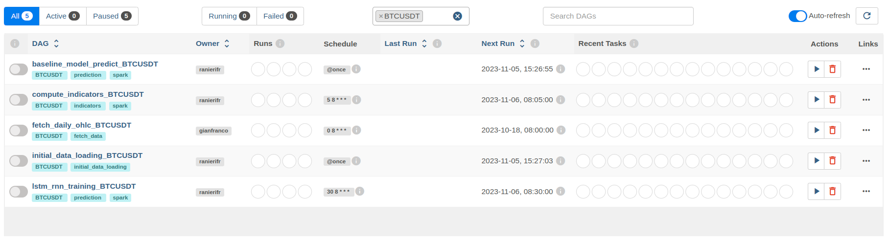
    <i>DAGs for the BITCOIN criptocurrency</i>
  </p>
</figure>

#### 1. Ingestion DAG (initial_data_loading)

The ingestion DAG is used to ingest the initial data from the CSV file into the database.  
This DAG as a *@once* shcedule, which means that it is executed only once.  


It is composed of only 2 tasks:
- `fetch_data`: 
  - reads the CSV file containing the historical data for the cryptocurrency and converts it into a common format
- `insert_into_cassandra_price_candlestick`: 
  - inserts the data into the *price_canldestick* table of the Cassandra database

<br>

<figure>
  <p align="center">
    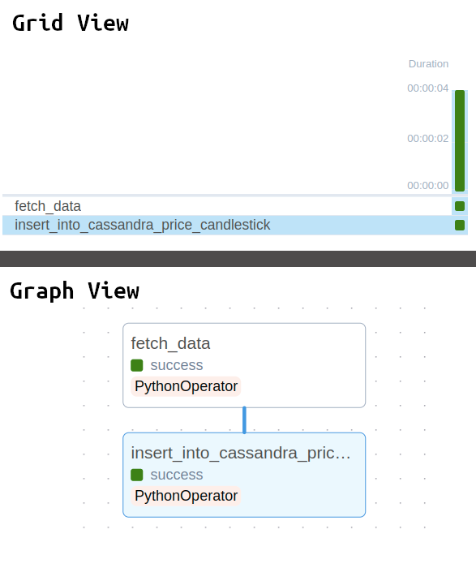
    <figcaption><i>initial_data_loading DAG composition</i></figcaption>
  </p>
</figure>

#### 2. Fetch daily data (fetch_daily_ohlc)

The fetch daily data DAG is used to periodically ingest real-time data from the Kraken API into the database.  
Since the platform uses daily data, the DAG is scheduled to run once a day.  
This DAG is configured with the *catchup* parameter set to *True*, which means that it will run all the missed DAG runs.  
So it will run once for each day since the last data point present in the CSV files to the current day.
The Krakend API has a limit of requests per minute, so some errors are expected when backfilling multiple days. The task is automatically rescheduled in case of error.

It is composed of 2 tasks:
- `fetch_data`: 
  - fetch the data from the Kraken API and converts it into a common format
- `insert_into_cassandra_price_candlestick`: 
  - inserts the data into the *price_canldestick* table of the Cassandra database

<figure>
  <p align="center">
  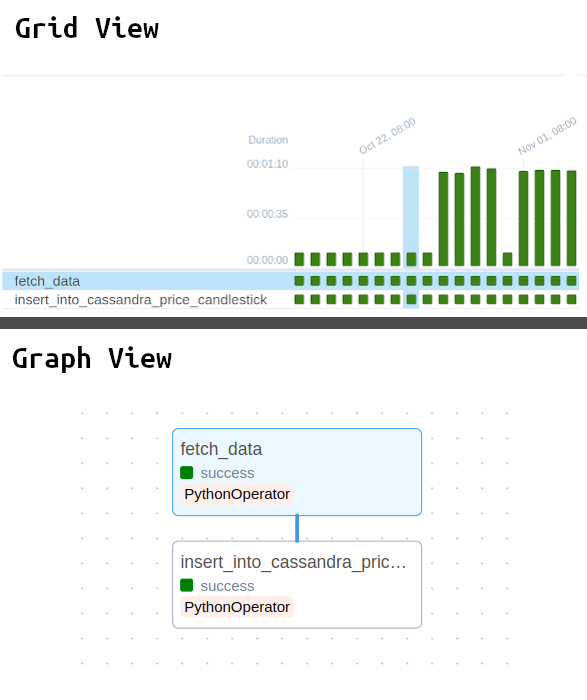
   <figcaption>
  <i>initial_data_loading DAG composition. Each of the green columns is a DAG run, automatically scheduled via the cathup option.</i></figcaption>
  </p>
</figure>

#### 3. Compute indicators (compute_indicators)

The compute indicators DAG is used to periodically compute SMA indicators on the data stored in the database.  
It computes SMA indicators with a window of 5, 10, 20, 50, 100, 200 data points.  
Since new data is ingested every day, the DAG is scheduled to run once a day to compute the indicators on the new data.
The computation is performed using Apache Spark:
  
```python
  # Calculate Simple Moving Average (SMA) for each window size
  for window_size in sma_window_sizes:
      # Define the column name for the SMA
      sma_column = f"sma_{window_size}"
      # Calculate the SMA using a window function
      df = df.withColumn(
        sma_column, 
        F.avg("close_price").over(window_spec.rowsBetween(-window_size, 0))
      )
```

It is composed of 4 tasks:
- `wait_for_initial_data_loading`: 
  - this is a special task called *sensor* in Airflow. It waits for the DAG *initial_data_loading* to complete before starting the DAG, to be sure that the data used by the computations is present in the database.  
  If the DAG *initial_data_loading* has not been executed yet, this task will wait for it to be executed and check again at a fixed interval.
- `fetch_data`: 
  - fetch the data from the Cassandra database and converts it into a common format.  
  The data is read by using the Spark SQL connector.
- `compute_indicators`: 
  - computes the SMA indicators using Apache Spark
- `insert_into_cassandra_indicators`: 
  - inserts the data into the *indicators* table of the Cassandra database

<br>

<figure>
  <p align="center">
  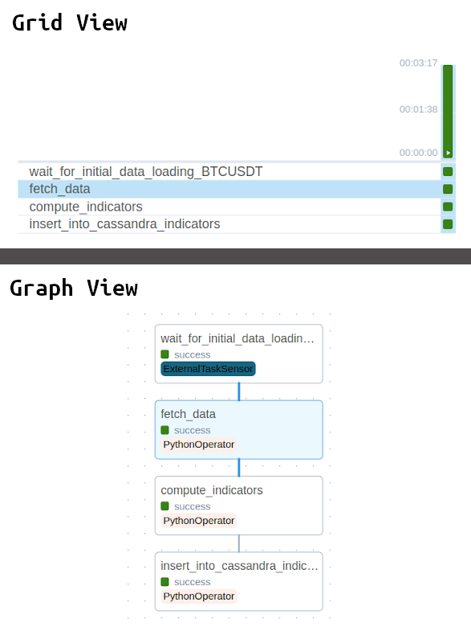
   <figcaption><i>compute_indicators DAG composition. The first task is an ExternalTaskSensor that waits for the initial_data_loading DAG to complete.</i></figcaption>
  </p>
</figure>

#### 4. Baseline model (baseline_model_predict)

The baseline model DAG is used to perform predictions with a baseline model, storing the results and performance metrics in the database.
The baseline model is a simple model that predicts the price of the next day as the price of the current day (Lag 1).
Thus it does not use any machine learning algorithm and doesn't require any training.
Since new data is ingested every day, the DAG is scheduled to run once a day to compute the predictions and metrics on the new data.

It is composed of 6 tasks:
- `wait_for_initial_data_loading`: 
  - this is a special task called *sensor* in Airflow. It waits for the DAG *initial_data_loading* to complete before starting the DAG, to be sure that the data used by the computations is present in the database.  
  If the DAG *initial_data_loading* has not been executed yet, this task will wait for it to be executed and check again at a fixed interval.
- `fetch_data`: 
  - fetch the data from the Cassandra database and converts it into a common format.  
  The data is read by using the Spark SQL connector.
- `predict`: 
  - performs the predictions with the baseline model
- `insert_into_cassandra_predictions`: 
  - inserts the predictions into the *predictions* table of the Cassandra database
- `compute_metrics`: 
  - computes the performance metrics of the model
- `insert_into_cassandra_metrics`:
  - inserts the performance metrics into the *metrics* table of the Cassandra database

<br>

<figure>
  <p align="center">
  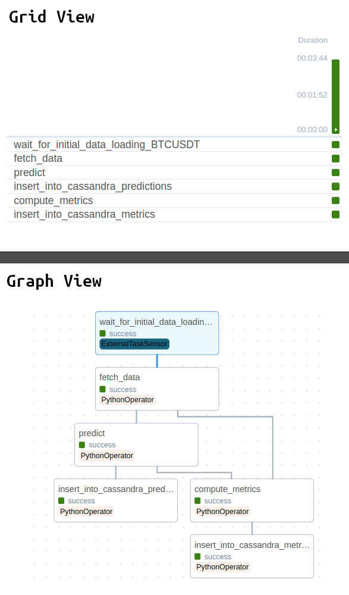
   <figcaption><i>baseline_model_predict DAG composition. The insert_into_cassandra_predictions and compute_metrics branches start in parallel after the *predict* task.</i>
   </figcaption>
   </p>
</figure>

#### 5. Custom model training and prediction (lstm_rnn_training)

The custom model training and prediction DAG is used to train a custom model, perform predictions and store the results and performance metrics in the database.
The model is an Neural Network (LSTM or RNN), built based on the results of the Optuna hyperparameter tuning.
Since new data is ingested every day, the DAG is scheduled to run once a day to retrain the model, compute the predictions and metrics on the new data.

It is composed of 7 tasks:

- `wait_for_initial_data_loading`: 
  - this is a special task called *sensor* in Airflow. It waits for the DAG *initial_data_loading* to complete before starting the DAG, to be sure that the data used by the computations is present in the database.  
  If the DAG *initial_data_loading* has not been executed yet, this task will wait for it to be executed and check again at a fixed interval.

- `fetch_data`:
  - fetch the data from the Cassandra database and converts it into a common format.  
  The data is read by using the Spark SQL connector.

- `train`:
  - This task retrieves the best hyperparameters from the MLFlow instance running on the cluster and builds a model with those hyperparameters.
  The model is then trained on the data and stored in the MLFlow instance.

- `predict`:
  - This task loads the model from the MLFlow instance and performs the predictions.
  
- `insert_into_cassandra_predictions`:
  - inserts the predictions into the *predictions* table of the Cassandra database

- `compute_metrics`:
  - computes the performance metrics of the model
  
- `insert_into_cassandra_metrics`:
  - inserts the performance metrics into the *metrics* table of the Cassandra database

<br>

<figure>
  <p align="center">
  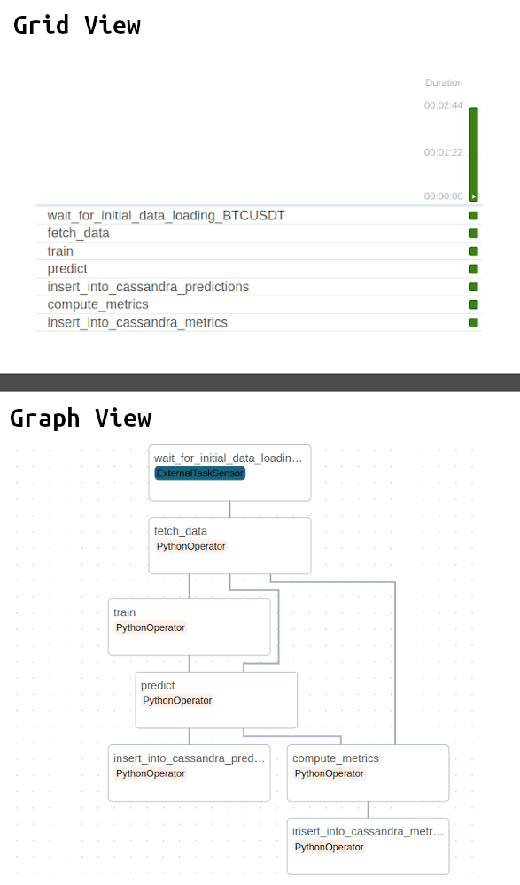
  <figcaption>
  <i>lstm_rnn_training DAG composition. The insert_into_cassandra_predictions and compute_metrics branches start in parallel after the predict task.</i>
  </figcaption>
  </p>
</figure>


## Visualization

Another core component of the Price Oracle project is the *Price Oracle Dashboard*, which is automatically created in Grafana via a *Kubernetes ConfigMap*.

The dashboard is dynamically created and leverages the *variables* feature of Grafana.
The list of the cryptocurrencies is stored into a *Grafana variable*, and this allow the user to select the cryptocurrency to visualize in the dashboard.

***Note**: the list of the cryptocurrencies in the variable is NOT dynamically updated at the moment.*

The default view presents the BTC/USDT pair.  
A select component in the top allows to select the cryptocurrency to visualize. Multiple cryptocurrencies can be selected at the same time.

<figure>
  <p align="center">
  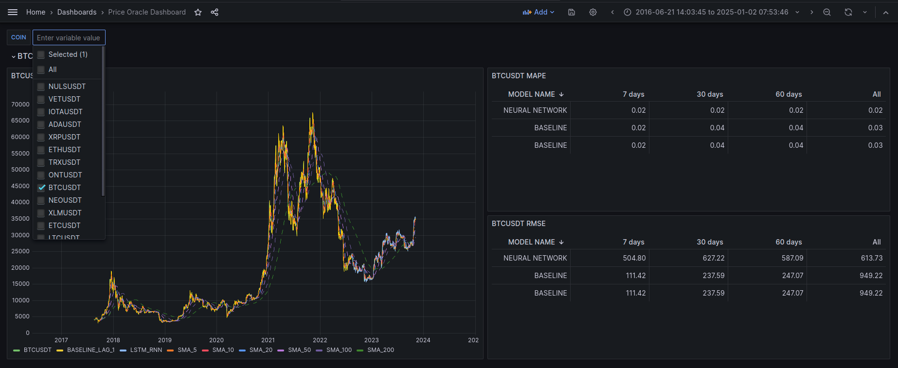
  <br>
  <i>Price Oracle Dashboard - Default view</i>
  </p>
</figure>

For each cryptocurrency, the dashboard shows 3 panels.  
The second and third panels are tables that show the MAPE and RMSE metrics of the baseline model and the custom model respectively.  
This metrics are computed by taking into account the last 7, 30, 60 days of data, and also the entire dataset.


<figure>
  <p align="center">
  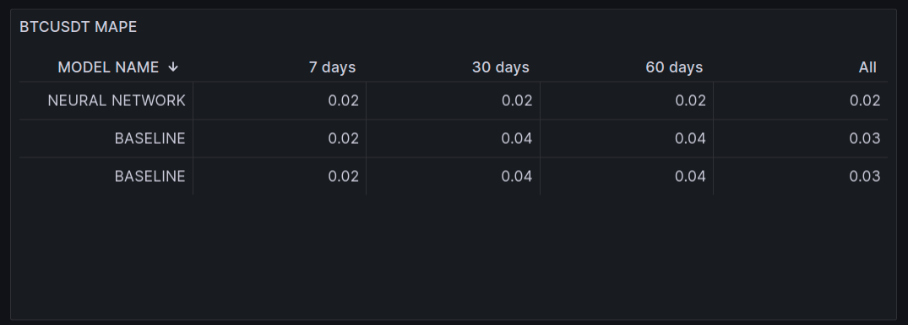
  <i>MAPE panel for BTCUSDT</i>
</p>
</figure>

<br>

<figure>
  <p align="center">
  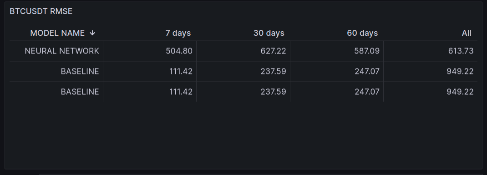
  <i>RMSE panel for BTCUSDT</i>
</p>
</figure>

<br>

The first panel is a graph that shows the price of the cryptocurrency as a line graph.
On top of the actual price, most of the data computed by the pipelines ends up here.  
The SMA indicators are shown as line graphs, with different colors for each window size.   
Also, the predictions of the baseline model and the custom model are justaposed. This allows to visually compare the predictions of the two models.

***Note**: each line can be toggled on and off by clicking on the legend.*

<figure>
  <p align="center">
  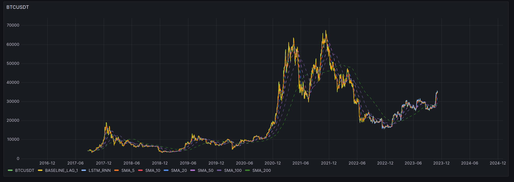
  <i>Price panel for BTCUSDT</i>
  </p>
</figure>

<figure>
  <p align="center">
  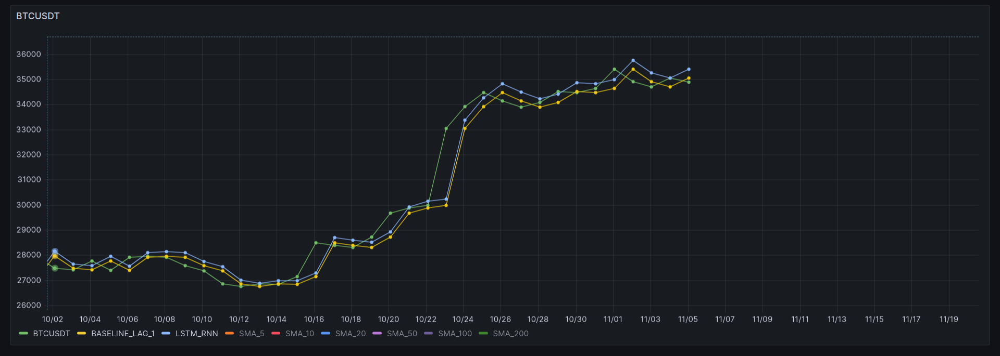
  <i>Price panel for BTCUSDT. Only the actual price and the prediction lines are enabled. The time range is restricted to show the differences between the 3 lines.</i>
  </p>
</figure>

<br>

## Issues and Future Directions

### Data concerns

During the development of the project, some problems emerged regarding the collection of data.  
During the last years, a lot of services offering data have been shut down, and the ones that are still available offer only a limited amount of data for free.  
For example, just during the development of the project, the Criptowatch API, that was selected as the main source of data, has been shut down (and replaced by the Kraken API).  
However, the Kraken API doesn't offer all of the coin pairs that were used in this project, so the *daily_data_fetch* DAG works only for some of the cryptocurrencies.

In general, it is becoming harder and harder to find a reliable source of data that offers a large amount of data for free, especially for some sectors like the cryptocurrency one.


### Models re-train and Concept Drift

For time related issues, the models are retrained entirely every day.  
However, the initial plan was to retrain the models only when the performance metrics were below a certain threshold, indicating a concept drift.
This would be easily implemented with the current architecture, editing the training DAG in this way:
- add an initial task that reads the performance metrics from the database
- add another task that predicts the all of the data (including the new data) and computes the performance metrics
- add a *sensor* that checks if the performance metrics are below the threshold (e.g: the new MAPE at 7 days is worse than the previous one by a certain number of standard deviations)
- if the *sensor* is triggered, the DAG continues with the training and prediction tasks; otherwise, there is no need to retrain the model.

### Pipelines for all models

For time related issues, only the pipelines for the LSTM and RNN models have been implemented, and only for the version considering the price time-series only.

However, experiments have been performed also with:
- a version considering the price time-series and the SMA indicators
- a version considering the criptocurrency in clusters
- a version using a VAR model.

Adding the pipelines for these models would be straightforward, since the architecture is already in place.
