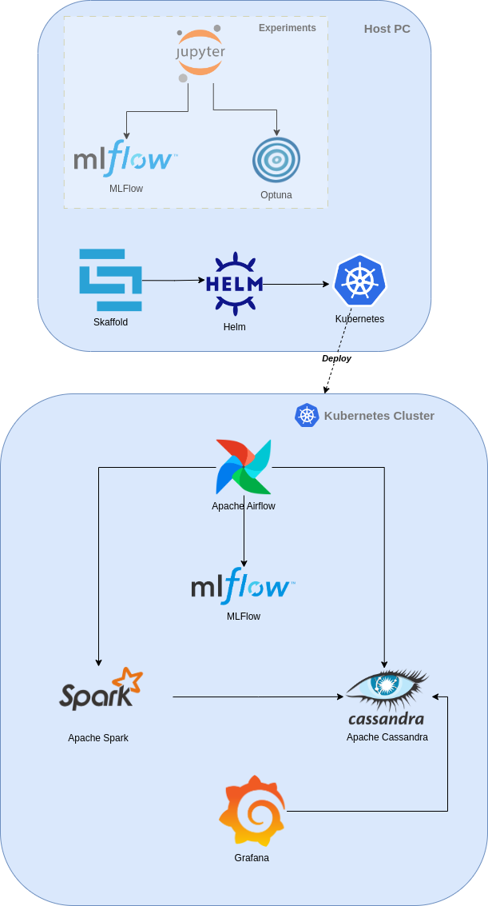

# Price Oracle

Price Oracle is an end-to-end solution for monitoring and predicting the price of criptocurrencies.  
It is composed data ingestion pipelines leveraging Apache Airflow, a data lake built on top of Apache Cassandra, machine learning models built with TensorFlow and a front-end built with Grafana.  
The automated data ingestion pipelines provide real-time data, which are used to train the machine learning models and to provide real-time predictions.

## Data
## Clustering
## Modeling
### Optuna

## Architecture

Price Oracle is developed in a fully containerized environment leveraging Docker, Kubernetes and Helm.

### Docker
### Kubernetes
### Helm
### Skaffold
### Kind

### Apache Airflow
### Apache Cassandra
### Apache Spark
### Grafana

## DAGs
## Dashboards

